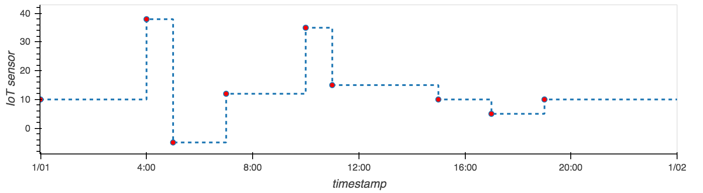

<h1 align="center">
  <span>ticts</span>
  
</h1>

<p align="center">
  <a href="https://github.com/gjeusel/ticts/actions?query=workflow%3ACI+branch%3Amain">
      
  </a>
  <a href="https://coverage-badge.samuelcolvin.workers.dev/redirect/gjeusel/ticts" alt="Test Coverage" onerror="this.style.display='none'">
      
  </a>
  <a href="https://pypi.org/project/ticts/">
      
  </a>
  <a href="https://gjeusel.github.io/ticts/">
    
  </a>
</p>

<p align="center">
  <em>
    A Python library for unevenly-spaced time series analysis.
    Greatly inspired by <a href="https://github.com/datascopeanalytics/traces">traces</a>
  </em>
</p>



Get Started [Notebook](https://mybinder.org/v2/gh/gjeusel/ticts/master?filepath=docs%2FTutorial.ipynb).

---

## Usage

```python
   from ticts import TimeSeries
   ts = TimeSeries({
      '2019-01-01': 1,
      '2019-01-01 00:10:00': 2,
      '2019-01-01 00:11:00': 3,
   })

   not_in_index = '2019-01-01 00:05:00'
   assert ts[not_in_index] == 1  # step function, previous value

   ts['2019-01-01 00:04:00'] = 10
   assert ts[not_in_index] == 10

   assert ts + ts == 2 * ts

   ts_evenly_spaced = ts.sample(freq='1Min')

   # From ticts to pandas, and the other way around
   assert ts.equals(
      ts.to_dataframe().to_ticts(),
   )
```

## Installation

```bash
pip install ticts
```
